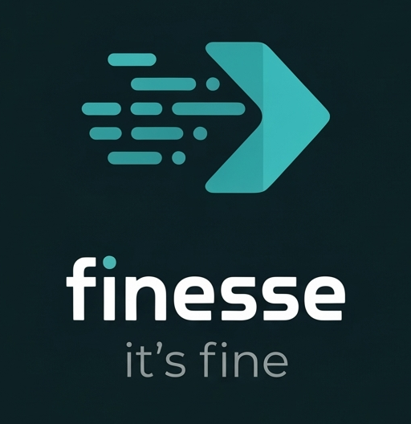

<p align="center">
  
</p>

# Finesse

Finesse replaces ActionCable's WebSocket transport with a lightweight Go binary that polls SolidCable's SQLite table and streams Turbo updates to browsers via Server-Sent Events (SSE). No WebSocket infrastructure needed — just a single binary alongside your Rails app.

## Prerequisites

Finesse currently supports **SolidCable with SQLite** only. Your Rails app needs:

- **[SolidCable](https://github.com/rails/solid_cable)** as your ActionCable adapter, with a `cable:` database configured in `config/database.yml`
- **[turbo-rails](https://github.com/hotwired/turbo-rails)** (>= 2.0) — Finesse uses Turbo's signed stream tokens for authentication

PostgreSQL and other adapters are on the [roadmap](#roadmap).

## Quick Start

1. Add to your Gemfile:
   ```ruby
   gem "finesse"
   ```

2. Install:
   ```sh
   bundle install
   ```

3. Add to your `Procfile.dev`:
   ```
   sse: bundle exec finesse --allow-origin http://localhost:3000
   ```
   For multiple origins (e.g., accessing from another device on your network), repeat the flag:
   ```
   sse: bundle exec finesse --allow-origin http://localhost:3000 --allow-origin http://192.168.1.10:3000
   ```

4. Start your app:
   ```sh
   bin/dev
   ```

## How It Works

```
Browser <turbo-stream-source> ──GET /events?signed_stream=…──> Finesse (Go binary, :4000)
                                                                     │
Rails app ──broadcast_append_to──> SolidCable ──INSERT──> SQLite ←──POLL─┘
```

Finesse polls the `solid_cable_messages` table for new rows and streams them as SSE events to connected browsers. It uses SQLite WAL mode for concurrent read access alongside Rails writes.

Key design choices:
- **Polling over triggers** — simple, no SQLite extensions required, 10ms default interval
- **Per-channel fan-out** — each channel gets its own broadcaster with a ring buffer for reconnection catch-up
- **Pure Go SQLite** — uses `modernc.org/sqlite` (no CGO), enabling easy cross-compilation

## CLI Options

| Flag | Default | Description |
|------|---------|-------------|
| `--port` | `4000` | HTTP listen port |
| `--db-path` | auto from `config/database.yml` | Path to SolidCable SQLite database |
| `--table-name` | `solid_cable_messages` | SolidCable messages table name |
| `--poll-interval` | `10` | Database poll interval (integer, milliseconds) |
| `--allow-origin` | *(required)* | `Access-Control-Allow-Origin` header value |

## Environment Variables

| Variable | Description |
|----------|-------------|
| `FINESSE_SIGNING_KEY` | Hex-encoded HMAC key for signed stream verification (auto-derived from Rails when using `bundle exec finesse`) |
| `BINDING` | Bind address (default: `127.0.0.1`) |

## Endpoints

| Path | Description |
|------|-------------|
| `GET /up` | Health check (returns 200) |
| `GET /events?signed_stream=<token>` | SSE stream for the given signed stream |

The SSE endpoint supports the `Last-Event-ID` header for automatic reconnection catch-up. Stream tokens use the same `ActiveSupport::MessageVerifier` format as Turbo's signed streams.

## Development

### Compiling from source

Requires Go 1.24+.

```sh
# Build for current platform
cd ext/finesse && go build -o ../../exe/$(ruby -e "puts Gem::Platform.local.cpu + '-' + Gem::Platform.local.os")/finesse .

# Cross-compile for all platforms
rake build:all
```

### Running tests

All build and test commands should be run via `bundle exec`:

```sh
bundle exec rake test          # Run Go + Ruby tests
bundle exec rake test:go       # Go tests only
bundle exec rake test:ruby     # Ruby tests only
```

### Running locally

```sh
./exe/arm64-darwin/finesse --port 4000 --db-path ../your-app/storage/development_cable.sqlite3
```

## Security

Finesse verifies every SSE connection using Turbo's signed stream tokens (HMAC-SHA256). CORS is restricted to the origins you specify with `--allow-origin`, and the server binds to `127.0.0.1` by default.

### Signing Key Flow

**TL;DR:** Finesse needs the same HMAC key that Turbo uses to sign stream names. The Ruby wrapper extracts it from Rails automatically — zero config in development.

The problem: Finesse is a standalone Go binary, but it needs to verify tokens that Rails signs. Rails derives its signing key from `SECRET_KEY_BASE` via PBKDF2, and that secret lives in encrypted credentials (`config/credentials.yml.enc`) which require Ruby's `Marshal` deserializer to read. Reimplementing that in Go would be fragile and version-dependent.

The solution: let Ruby do the Ruby parts, then hand the result to Go.

```
        Rails Boot                           Finesse Boot
        ──────────                           ────────────

config/credentials.yml.enc           exe/finesse (Ruby wrapper)
           │                                    │
           ▼                                    ▼
      SECRET_KEY_BASE                rails runner "Finesse.signing_key"
           │                                    │
           ▼                                    ▼
      PBKDF2-HMAC-SHA256             Turbo.signed_stream_verifier_key
      salt: "turbo/signed_                      │
            stream_verifier_key"                ▼
      iterations: 65,536             hex-encode the derived key
      output: 64 bytes                          │
           │                                    ▼
           ▼                         ENV["FINESSE_SIGNING_KEY"] = hex
      Turbo.signed_stream_                      │
        verifier_key                            ▼
           │                         exec(go_binary)
           ▼                           ├── reads env, decodes hex
      turbo_stream_from @chat          └── verifies HMAC on every
      signs channel name ─────────▶  /events?signed_stream=<token>
```

**Token format** (Rails `ActiveSupport::MessageVerifier`):
```
base64strict(json(channel_name))--hex(hmac_sha256(base64_data, derived_key))
```

The Go binary splits the token on `--`, recomputes the HMAC over the base64 data, and compares using constant-time `hmac.Equal`. If it matches, the channel name is trusted.

**In development**, this is fully automatic — Rails writes `secret_key_base` to `tmp/local_secret.txt` and the wrapper reads it. **In production**, either let the wrapper derive the key at boot (slower — spawns a `rails runner`), or set `FINESSE_SIGNING_KEY` directly as a hex-encoded env var to skip the Rails boot entirely.

## Production Deployment

Finesse binds to `127.0.0.1` by default and should **not** be exposed directly on port 80/443. Run it alongside your app server (Puma, etc.) on the same host and proxy to it from your web server. For example, with Nginx:

```nginx
upstream finesse {
  server 127.0.0.1:4000;
}

location /finesse/ {
  proxy_pass http://finesse/;
  proxy_set_header Host $host;
  proxy_set_header X-Forwarded-For $proxy_add_x_forwarded_for;

  # SSE requires unbuffered responses
  proxy_buffering off;
  proxy_cache off;
  proxy_read_timeout 86400s;
}
```

### Kamal

If you deploy with [Kamal](https://kamal-deploy.org), add Finesse as a separate server role in `config/deploy.yml`. kamal-proxy automatically detects `Content-Type: text/event-stream` responses and disables buffering — no extra proxy configuration needed.

```yaml
servers:
  web:
    - <your-public-server-ip>
  sse:
    hosts:
      - <your-public-server-ip>
    cmd: bundle exec finesse --allow-origin "https://yourapp.com"
    proxy:
      ssl: true
      host: sse.yourapp.com
      app_port: 4000
      healthcheck:
        path: /up
```

Point a DNS record for `sse.yourapp.com` at your server and kamal-proxy handles TLS and routing.

Set `FINESSE_SIGNING_KEY` as a hex-encoded env var in production to avoid a `rails runner` invocation on every boot. The `--allow-origin` flag should match your production domain.

## Roadmap

- **Rails generator** — `rails g finesse:install` for config, initializer, and binstub
- **Engine/Railtie** — view helpers (`finesse_sse_url`)
- **PostgreSQL support** — `LISTEN/NOTIFY` adapter as alternative to SQLite polling. 8KB limit may not be worth it, but polling in PostgreSQL would still be on the roadmap.

## License

MIT License. See [LICENSE](LICENSE) for details.
